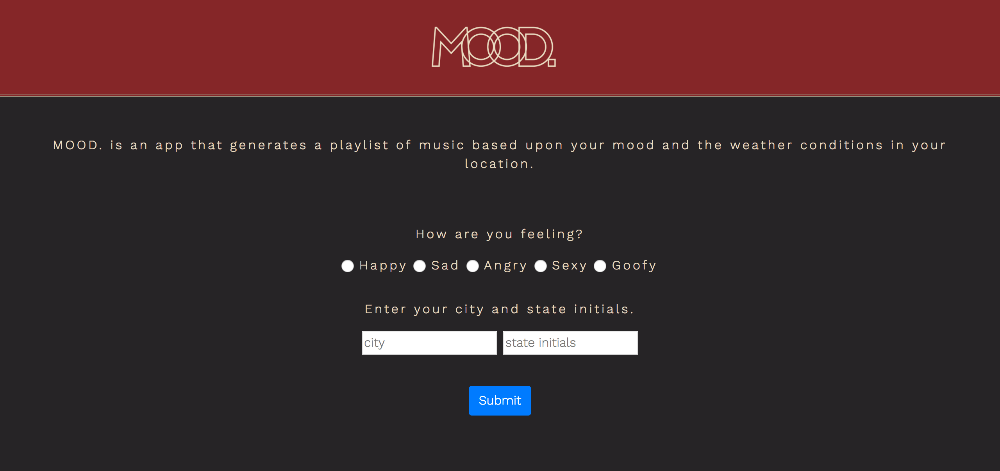
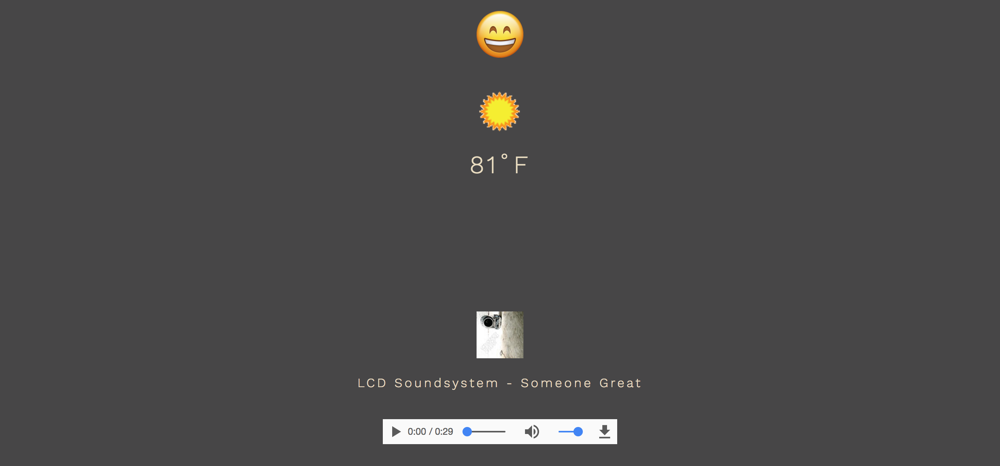
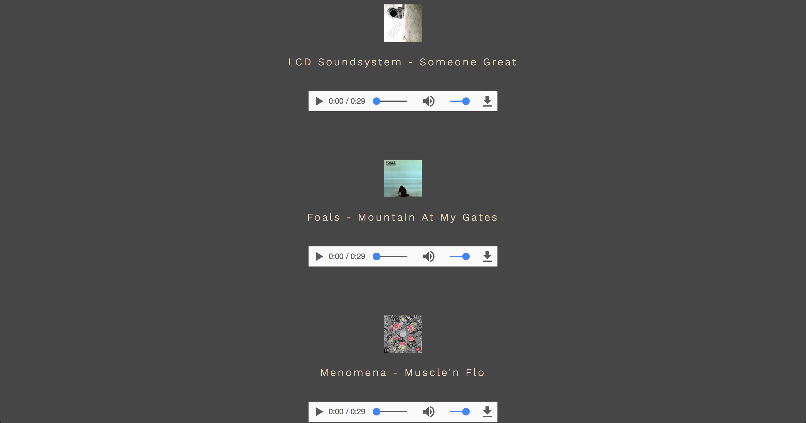

# MOOD.

## Motivation
99% of people love music, and they also have their favorite bands and artists that they go to all of the time. However, sometimes people need something new. We get tired of the same Artist and same song everyday. Often people will ask friends or search on the internet for new bands/artists. However sometimes we are recommended music that just doesn't fit how we are feeling at that particular time. We need something that can give us a list of music based on how we are doing that day.

MOOD. is an app that generates a playlist of 10 songs based on the weather where the user is and on the users mood and emotional state at that time.

## Where to find MOOD.
[Click here to visit MOOD.](https://mood-q1.firebaseapp.com/)

## Screenshots

## Walkthrough
[Click here watch MOOD. in action!](https://youtu.be/hJrmwzzpLfk)

## API's Used
1. WeatherUnderground
2. iTunes

## Features
1. Form of radio buttons for the user to input their current mood.
2. Form of 2 text fields for the user to input their current city/state.
3. A submit button to submit the users mood and location.
4. After the submit button is pressed with a mood and a location, the user then will see his/her current mood displayed as an emoji along with an icon of their weather conditions (ie - clear, partly cloudy, rain, etc.). Below the weather icon will be a text print out of the current temperature in fahrenheit. Finally, a list of 10 songs will appear. For each song 3 items will display: an image with the song's album art, the name of the artist and the name of the song, and an audio player with a sample of the song. The song player has controls for play/pause toggler, a time slider, mute toggler, a volume slider, and a download button.
